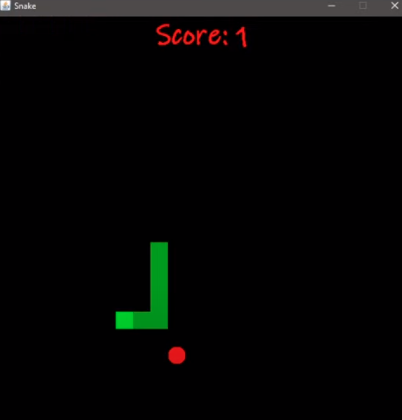
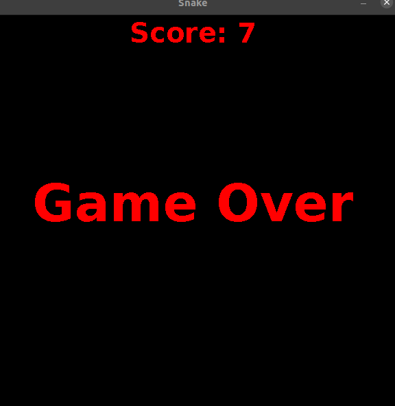

# Snake-Game
Snake is a classic video game in which a player controls a Snake that must eat apples and avoid walls. Each time, you eat an apple, the Snake grows. The Snake’s goal is to eat the maximum of apples. It’s a game of kind infinite.

## Functionalities:
* Snake can move in a given direction and when it eats the food, the length of snake increases. 
* When snake crosses itself or hit the wall, the game will over. 
* Food will be generated at a given interval.

# Technology
Snake Game using Object Oriented Programming (OOP) concepts and implement it using Java.

# Game Mode

## License
Licensed under the [MIT License](LICENSE).
